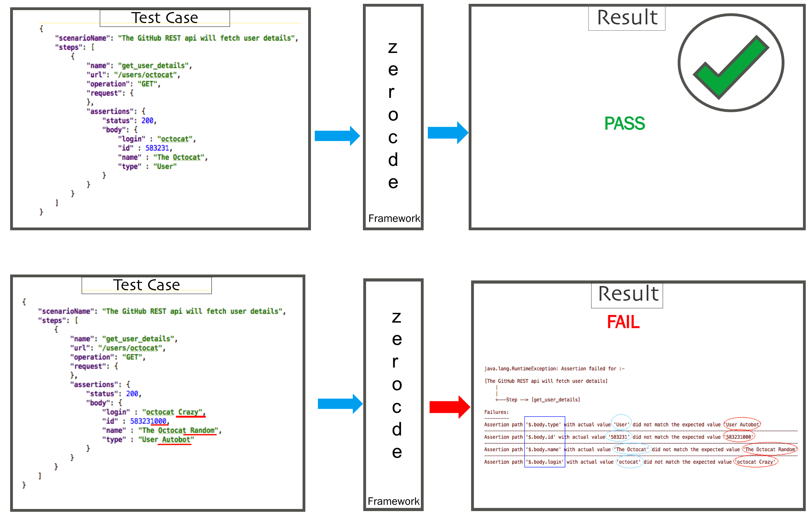

Zerocode
====
A simple and light weight automation testing lib for api end point tests.

> The purpose of Zerocode lib is to make your API tests easy to **write**, easy to **change**, easy to **share**.

**Latest release: [1.1.34](http://search.maven.org/#search%7Cga%7C1%7Czerocode)**

**HelloWorld:** [Calling a GitHub api](https://github.com/authorjapps/zerocode-hello-world/blob/master/src/test/resources/helloworld/hello_world_status_ok_assertions.json) step and executing [Test](https://github.com/authorjapps/zerocode-hello-world/blob/master/src/test/java/org/jsmart/zerocode/testhelp/tests/helloworld/JustHelloWorldTest.java) code. <br/>
**Continuous Integration:** [](https://travis-ci.org/authorjapps/zerocode) <br/>
**Help and Usage:** [Table of Contents](https://github.com/authorjapps/zerocode#table-of-contents--) <br/>
**Wiki:** [About Zerocode](https://github.com/authorjapps/zerocode/wiki) <br/>
**License:** [Apache 2.0](http://www.apache.org/licenses/LICENSE-2.0) <br/>

> Make your test-driven API development efficient, accurate, fast and fun.

Keep things simple, Zerocode alleviates the need of writing `code` for test assertions and boiler plate wrappers. It empowers the automation testers as well as developers to build up test scenario steps effortlessly, with asserting the entire or partial result as JSON `as it is`. The repititive tasks of the everyday automation have been taken care optimally at the framework level, enables you to focus on business bcenarios, user journeys and acceptance criterias efficiently. 

[](https://github.com/authorjapps/zerocode-hello-world/archive/master.zip) 
[](https://github.com/authorjapps/zerocode/blob/master/LICENSE) 
[](https://github.com/authorjapps/zerocode/blob/master/img/code_coverage/code_coverage_granular.png)
[](https://github.com/authorjapps/zerocode/issues) 
[](https://github.com/authorjapps/zerocode-hello-world) 
[](https://github.com/authorjapps/zerocode/issues/28) 
[](https://gitter.im/zerocode-testing/help-and-usage)
[](https://www.codeproject.com/search.aspx?q=zerocode&x=0&y=0&sbo=kw)


Supported testing frameworks:
 * [JUnit](http://junit.org)

Latest maven release:
```
<dependency>
    <groupId>org.jsmart</groupId>
    <artifactId>zerocode-rest-bdd</artifactId>
    <version>1.1.34</version> 
</dependency>
```
But check here for the latest- 
https://github.com/authorjapps/zerocode/releases -or- [Maven Central](https://mvnrepository.com/artifact/org.jsmart/zerocode-rest-bdd)

Zerocode helps you to design better Test Cases for your business features, maintain and update easily to avoid sleepless nights. It is built on extending the **Junit core runners**. You simply annotate your test method with JUnit **@Test** and run like unit tests, as well optionally you can use`Suite` Runner for CI builds. 

Testing becomes an easy and effortless job due to the **simplicity** nature of JSON and the native support by popular IDEs e.g. Eclipse /IntelliJ /NetBeans etc with no extra plugin. Your tests will not be cumbersome and complex anymore. Zerocode makes your tests independent, complete and structured and easily maintainable by the team or the new comers. It enables you to write your `API End Point Tests`, `Consumer Contract Tests` and `End to End Tests` etc, at the **speed** of writing **JUnit** tests.

[More >>](https://github.com/authorjapps/zerocode/wiki)

## REST BDD Testing Framework

Develop and test applications with TDD and BDD approach while easily building up your regression suites. 

Execute your complex business scenario steps with simple jsons which defines your RESTful service behaviour.

Use the **powerful response assertions** mechanism with simple JSON requests/responses. 

<pre><code><del>
Testing no more a harder, slower and sleepless task
</del></code></pre>

|  <br/> **Prepare scenario** |  <br/> **Build up step(s)** |  &nbsp; &nbsp; <br/> **Execute** |
|:-------------:|:-------------:|:-------------:|
| Pick a "business scenario" or an "acceptance criteria", then convert it into easy and clean "JSON steps". | Assert the step(s) outcome with expected response "as it is" and optionally weave the next step to the earlier step input(s), using simple "JSON path" e.g. "created customerId", "customerType" etc. i.e. "$.step1.response.body.customerId" | Run the scenario using "@Test" annotation as a "JUnit" test or as "Suite" of tests as part of CI build.|

Look for examples below-

See the [HelloWorldTest](https://github.com/authorjapps/zerocode-hello-world/blob/master/src/test/java/org/jsmart/zerocode/testhelp/tests/helloworld/JustHelloWorldTest.java) and [more](https://github.com/authorjapps/zerocode-hello-world/blob/master/src/test/java/org/jsmart/zerocode/testhelp/tests/helloworldmore/JustHelloWorldMoreTest.java)


### Easy! Simple! Readable! JSON Based!

```
@TargetEnv("github_host.properties")
@RunWith(ZeroCodeUnitRunner.class)
public class JustHelloWorldTest {

    @Test
    @JsonTestCase("helloworld/hello_world_status_ok_assertions.json")
    public void testGet() throws Exception {

    }
}
```

the `hello_world_status_ok_assertions.json` looks as below:
```
{
    "scenarioName": "GIVEN-the GitHub REST end point, WHEN-I invoke GET, THEN-I will receive the 200 status with body",
    "steps": [
        {
            "name": "get_user_details",
            "url": "/users/siddhagalaxy",
            "operation": "GET",
            "request": {
            },
            "assertions": {
                "status": 200,
                "body": {
                    "login" : "siddhagalaxy",
                    "id" : 33847730,
                    "type" : "User",
                    "followers_url" : "https://api.github.com/users/siddhagalaxy/followers"
                }
            }
        }
    ]
}
```

the `github_host.properties` looks as below:
```
restful.application.endpoint.host=https://api.github.com
restful.application.endpoint.port=443
restful.application.endpoint.context=
```

#### Define a Scenario with Steps, Then Run as JUnit([example](https://github.com/authorjapps/zerocode-hello-world/blob/master/src/test/java/org/jsmart/zerocode/testhelp/tests/helloworld/JustHelloWorldTest.java)) or run as Suite/Package([example](https://github.com/authorjapps/zerocode-hello-world/blob/master/src/test/java/org/jsmart/zerocode/testhelp/tests/HelloWorldGitHubSuite.java)). See examples below-

## Table of Contents - 
- [Help and usage](#1)
- [Overriding with Custom HttpClient with Project demand, See also SSL Trusted Http Client](#16)
- [Externalize host and port to properties files](#17)
- [Single Scenario with single step](#2)
- [Step with more assertions](#3)
- [Running with step loop](#4)
- [Running with scenario loop](#5)
- [Generated reports and charts](#6)
- [More assertion with handy place holders](#7)
- [General Place holders](#8)
- [Dealing with arrays](#9) 
- [Chaining multiple steps for a scenario](#10)
- [Generating random strings, random numbers and static strings](#11)
- [Asserting general and exception messages](#12)
- [Asserting with LT(lesser than) and GT(greater than)](#13)
- [Asserting an empty array)](#14)
- [Calling java methods(apis) for specific tasks)](#15)
- [Generating IDs and sharing across steps](#18)
- [Bare JSON String without curly braces, still a valid JSON](#19)
- [Passing Headers to the REST API](#20) 
- [Setting Jenkins env propperty and picking environment specific properties file](#21)
- [LocalDate and LocalDateTime format example](#22)
- [SOAP method invocation example using xml input](#23)
- [SOAP method invocation where Corporate Proxy enabled](#24)
- [MIME Type Converters- XML to JSON, prettyfy XML etc](#25)
- [Using WireMock for mocking dependent end points](#26)
- [General place holders and assertion place holder table](#99)
- [References and Dicussions](#100)


### examples:

#### 1:
#### Help and usage

Download this help and usage project to try it yourself.

- HelloWorld project: https://github.com/authorjapps/zerocode-hello-world

- Simple steps to run: https://github.com/authorjapps/zerocode-hello-world#zerocode-hello-world

- Git [Clone](https://github.com/authorjapps/zerocode-hello-world) or [Download](https://github.com/authorjapps/zerocode-hello-world/archive/master.zip) the zip file(contains a maven project) to run locally 


#### 2:
#### Single Scenario with single step

A scenario might consists of one or more steps. Let's start with single step Test Case:
```
{
  "scenarioName": "Vanilla - Will Get Google Employee Details",
  "steps": [
    {
      "name": "step1_get_google_emp_details",
      "url": "http://localhost:9998/google-emp-services/home/employees/999",
      "operation": "GET",
      "request": {
      },
      "assertions": {
        "status": 200
      }
    }
  ]
}
```

Note:
The above JSON block is a test case where we asked the test framework to hit the 
> REST end point : http://localhost:9998/google-emp-services/home/employees/999

> with method: GET 

> and asserting the REST response with an  

> expected status: 200

> where, step "name" is a meaningful step name, which is significant when multiple steps are run. See a multi-step example.

Note:
> scenarioname : is free text

> step name: free text without any space


The above Test Case will PASS as the end point actually available is as below. Look at the "response" section below.
```
        {
          "name": "Sample_Get_Employee_by_Id",
          "operation": "GET",
          "url": "/google-emp-services/home/employees/999",
          "response": {
            "status": 200,
            "body": {
              "id": 999,
              "name": "Larry P",
              "availability": true,
              "addresses":[
                {
                  "gpsLocation": "x3000-y5000z-70000"
                },
                {
                  "gpsLocation": "x3000-y5000z-70000S"
                }
              ]
            }
          }
        }
```

The following Test Case will fail. Why? 

Because you are asserting with an expected status as 500, but the end point actually returns 200.

```
{
  "scenarioName": "Vanilla - Will Get Google Employee Details",
  "steps": [
    {
      "name": "step1_get_google_emp_details",
      "url": "http://localhost:9998/google-emp-services/home/employees/999",
      "operation": "GET",
      "request": {
      },
      "assertions": {
        "status": 500
      }
    }
  ]
}
```

#### 3:
#### Single step with more assertions

```
{
  "scenarioName": "Vanilla - Will Get Google Employee Details",
  "steps": [
    {
      "name": "step1_get_google_emp_details",
      "url": "http://localhost:9998/google-emp-services/home/employees/999",
      "operation": "GET",
      "request": {
      },
      "assertions": {
        "status": 200,
        "body": {
          "id": 999,
          "name": "Larry P",
          "availability": true,
          "addresses":[
            {
              "gpsLocation": "x3000-y5000z-70000"
            },
            {
              "gpsLocation": "x3000-y5000z-70000S"
            }
          ]
        }
      }
    }
  ]
}
```

The above Test Case will PASS as the assertions section has all expected values matching the end point's response.

#### 4:
#### Running with step _loop_

- Usage: See here: [Step loop](https://github.com/authorjapps/helpme/blob/master/zerocode-rest-help/src/test/resources/tests/00_sample_test_scenarios/02_using_step_loop.json)

- _loop_ field in a step will execute the step that many number of time.

```
{
  "scenarioName": "Vanilla - Execute multiple times - Step",
  "steps": [
    {
      "loop": 2,
      "name": "get_room_details",
      "url": "http://localhost:9998/google-emp-services/home/employees/101",
      "operation": "GET",
      "request": {
      },
      "assertions": {
        "status": 200,
        "body": {
          "id": 101
        }
      }
    }
  ]
}
```


#### 5:
#### Running with scenario _loop_

- Usage: See here: [Scenario loop](https://github.com/authorjapps/helpme/blob/master/zerocode-rest-help/src/test/resources/tests/00_sample_test_scenarios/03_using_scenario_loop.json)
Runs the entire scenario two times i.e. executing both the steps once for each time.

```
{
  "scenarioName": "Vanilla - Execute multiple times - Scenario",
  "loop": 2,
  "steps": [
    {
      "name": "get_room_details",
      "url": "http://localhost:9998/google-emp-services/home/employees/101",
      "operation": "GET",
      "request": {
      },
      "assertions": {
        "status": 200,
        "body": {
          "id": 101
        }
      }
    },
    {
      "name": "get_another_room_details",
      "url": "http://localhost:9998/google-emp-services/home/employees/102",
      "operation": "GET",
      "request": {
      },
      "assertions": {
        "status": 200,
        "body": {
          "id": 102
        }
      }
    }
  ]
}
```


#### 6:
#### Generated reports and charts

Generated test statistics reports. See the '/target' folder after every run. 
e.g. Look for-
- target/zerocode_full_report_2018-01-31T17-15-47.125.csv
- target/zerocode-interactive.html

See sample reports below

##### Spike Chart:

1. [Full coverage CSV report](https://github.com/authorjapps/helpme/blob/master/zerocode-rest-help/src/test/resources/zz_reports/zerocode_full_report_2016-07-30T11-44-14.512.csv)

1. [Interactive - Chart(Filter by Author, Test name, status etc)](http://htmlpreview.github.io/?https://github.com/authorjapps/helpme/blob/master/zerocode-rest-help/src/test/resources/zz_reports/zerocode-interactive.html)


##### CSV Report:

- See here : [Full coverage CSV report](https://github.com/authorjapps/helpme/blob/master/zerocode-rest-help/src/test/resources/zz_reports/zerocode_full_report_2016-07-30T11-44-14.512.csv)

```
If target folder has permission issue, the library alerts with-
----------------------------------------------------------------------------------------
Somehow the 'target/zerocode-test-reports' is not present or has no report JSON files. 
Possible reasons- 
   1) No tests were activated or made to run via ZeroCode runner. -or- 
   2) You have simply used @RunWith(...) and ignored all tests -or- 
   3) Permission issue to create/write folder/files 
   4) Please fix it by adding/activating at least one test case or fix the file permission issue
----------------------------------------------------------------------------------------
```

#### 7:
#### More assertion with handy place holders

- Link: [See test cases folder](https://github.com/authorjapps/helpme/tree/master/zerocode-rest-help/src/test/resources/tests/00_sample_test_scenarios)


#### 8:
#### REST endpoint calls with General Place holders


- Link: [See test cases folder](https://github.com/authorjapps/helpme/tree/master/zerocode-rest-help/src/test/resources/tests/00_sample_test_scenarios)


#### 9:
#### Step dealing with arrays

- Link: [See test cases folder](https://github.com/authorjapps/helpme/tree/master/zerocode-rest-help/src/test/resources/tests/00_sample_test_scenarios)


#### 10:
#### Chaining multiple steps for a scenario

Chaining steps: Multi-Step REST calls with earlier response(IDs etc) as input to next step

```
{
    "scenarioName": "12_chaining_multiple_steps_using_previous_response",
    "steps": [
        {
            "name": "create_new_employee",
            "url": "http://localhost:9998/google-emp-services/home/employees",
            "operation": "POST",
            "request": {},
            "assertions": {
                "status": 201,
                "body": {
                    "id": 1000
                }
            }
        },
        {
            "name": "get_and_verify_created_employee",
            "url": "http://localhost:9998/google-emp-services/home/employees/${$.create_new_employee.response.body.id}", //<--- ID from previous response //
            "operation": "GET",
            "request": {},
            "assertions": {
                "status": 200,
                "body": {
                    "id": 1000,
                    "name": "${$.create_new_employee.response.body.name}",
                    "addresses": [
                        {
                            "gpsLocation": "${$.create_new_employee.response.body.addresses[0].gpsLocation}"
                        },
                        {
                            "gpsLocation": "${$.create_new_employee.response.body.addresses[1].gpsLocation}"
                        }
                    ]
                }
            }
        }
    ]
}
```

- Example : [Scenario with two steps - 1st create and then get](https://github.com/authorjapps/helpme/blob/master/zerocode-rest-help/src/test/resources/tests/00_sample_test_scenarios/12_chaining_multiple_steps_with_prev_response.json)
- Link: [See test cases folder](https://github.com/authorjapps/helpme/tree/master/zerocode-rest-help/src/test/resources/tests/00_sample_test_scenarios)


#### 11:
#### Generating random strings, random numbers and static strings

Random UUID-
```
{
  "scenarioName": "random_UUID",
  "steps": [
    {
      "name": "create_new_employee",
      "url": "http://localhost:9998/google-emp-services/home/employees",
      "operation": "POST",
      "request": {
        "body": {
          "id": "${RANDON.UUID}", //<-- Everytime it creates unique uuid. See below example.
          "name": "Elen M"   
        }
      },
      "assertions": {
        "status": 201
      }
    }
  ]
}

Resolves to-
{
  "scenarioName": "random_UUID",
  "steps": [
    {
      "name": "create_new_employee",
      "url": "http://localhost:9998/google-emp-services/home/employees",
      "operation": "POST",
      "request": {
        "body": {
          "id": "94397df8-0e9e-4479-a2f9-9af509fb5998", //<-- Every time it runs, it creates an unique uuid
          "name": "Elen M"   
        }
      },
      "assertions": {
        "status": 201
      }
    }
  ]
}
```

Random String of specific length-
```
{
  "scenarioName": "13_random_and_static_string_number_place_holders",
  "steps": [
    {
      "name": "create_new_employee",
      "url": "http://localhost:9998/google-emp-services/home/employees",
      "operation": "POST",
      "request": {
        "body": {
          "id": 1000,
          "name": "Larry ${RANDOM.STRING:5}",   //<-- Random number of length 5 chars
          "password": "${RANDOM.STRING:10}"     //<-- Random number of length 10 chars
        }
      },
      "assertions": {
        "status": 201
      }
    }
  ]
}
```

resolves to the below POST request to the end point:
```
step:create_new_employee
url:http://localhost:9998/google-emp-services/home/employees
method:POST
request:
{
  "body" : {
    "id" : 1000,
    "name" : "Larry tzezq",
    "password" : "czljtmzotu"
  }
} 

```

See full log in the log file, looks like this:
```
requestTimeStamp:2016-08-01T15:37:20.555
step:create_new_employee
url:http://localhost:9998/google-emp-services/home/employees
method:POST
request:
{
  "body" : {
    "id" : 1000,
    "name" : "Larry tzezq",
    "password" : "czljtmzotu"
  }
} 

Response:
{
  "status" : 201,
  ...
}
*responseTimeStamp:2016-08-01T15:37:20.707 
*Response delay:152.0 milli-secs 
---------> Assertion: <----------
{
  "status" : 201
} 
-done-
 
--------- RELATIONSHIP-ID: 4cfd3bfb-a537-49a2-84a2-0457c4e65803 ---------
requestTimeStamp:2016-08-01T15:37:20.714
step:again_try_to_create_employee_with_same_name_n_password
url:http://localhost:9998/google-emp-services/home/employees
method:POST
request:
{
  "body" : {
    "id" : 1000,
    "name" : "Larry tzezq",
    "password" : "czljtmzotu"
  }
} 
--------- RELATIONSHIP-ID: 4cfd3bfb-a537-49a2-84a2-0457c4e65803 ---------
Response:
{
  "status" : 201,
  ...
}
*responseTimeStamp:2016-08-01T15:37:20.721 
*Response delay:7.0 milli-secs 
---------> Assertion: <----------
{
  "status" : 201
} 
-done-

```

- Link: [See test cases folder](https://github.com/authorjapps/helpme/tree/master/zerocode-rest-help/src/test/resources/tests/00_sample_test_scenarios)


#### 12:
#### Asserting general and exception messages

Asserting with $CONTAINS.STRING:

```
{
      ...
      ...
      "assertions": {
        "status": 200,
        "body": {
          "name": "$CONTAINS.STRING:Larry"   //<-- PASS: If the "name" field in the response contains "Larry".
        }
      }
}
```

- Similar way exception messages can be asserted for part or full message.

- Link: [See test cases folder](https://github.com/authorjapps/helpme/tree/master/zerocode-rest-help/src/test/resources/tests/00_sample_test_scenarios)


#### 13:
#### Asserting with $GT or $LT

$GT.<any_number>

```
{
  ...
  ...
  "assertions": {
    "status": "$GT.198"   //<--- PASS: 200 is greater than 198
  }
}

```

$LT.<any_number>
```
{
  ...
  ...
  "assertions": {
      "status": "$LT.500"   //<--- PASS: 200 is lesser than 500
  }
}

```

- Link: [See full examples](https://github.com/authorjapps/helpme/tree/master/zerocode-rest-help/src/test/resources/tests/00_sample_test_scenarios)


#### 14:
#### Asserting empty array with $[]

```
    {
      ...
      ...
      "assertions": {
        "status": 200,
        "body": {
          "id": "$NOT.NULL",
          "vehicles": "$[]"         //<--- PASS: if the response has empty "vehicles"
        }
      }
    }
```

- Link: [See full examples](https://github.com/authorjapps/helpme/tree/master/zerocode-rest-help/src/test/resources/tests/00_sample_test_scenarios)


#### 15:
#### Calling java methods(apis) for doing specific tasks:

```
{
      "name": "a_pre_step",
      "url": "org.jsmart.zerocode.testhelp.utils.DbCleanUp",        //<--- class name
      "operation": "executeSql",                                    //<-- method name
      "request": "/scripts/sql/01_clean_up_db_and_sequences.sql",   //<--- parameter to the "executeSql" method
      "assertions": {}
}
```

In case a return from a java API needed assertion:
```
    {
      "name": "another_pre_step",
      "url": "org.jsmart.zerocode.testhelp.utils.DbCleanUp",            //<--- class name
      "operation": "executeSqlReturnStatus",                            //<-- method name
      "request": "/scripts/sql/02_clean_up_db_and_return_status.sql",   //<--- parameter to the "executeSqlReturnStatus" method
      "assertions": {
        "result" : "SUCCESS"  //<--- returned result from java API
      }
    }

```

- Link: [See here an example test](https://github.com/authorjapps/helpme/blob/master/zerocode-rest-help/src/test/resources/tests/00_sample_test_scenarios/11_execute_local_java_program.json)

- Link: [All examples root folder](https://github.com/authorjapps/helpme/blob/master/zerocode-rest-help/src/test/resources/tests/00_sample_test_scenarios)


#### 16:
#### Overriding with Custom HttpClient with Project demand

See here how to Use SSL HttpClient : [See usage of @UseHttpClient](https://github.com/authorjapps/zerocode/blob/master/src/test/java/org/jsmart/zerocode/core/verification/SslTrustUseHttpClientTest.java)

See here custom one : [See usage of @UseHttpClient](https://github.com/authorjapps/helpme/blob/master/zerocode-rest-help/src/test/java/org/jsmart/zerocode/testhelp/zcmore/ZeroCodeUnitRunnerWithCustomHttpClient.java)

e.g.
```
@UseHttpClient(SslTrustHttpClient.class)
@TargetEnv("hosts_ci.properties")
@RunWith(ZeroCodeUnitRunner.class)
public class SslTrustUseHttpClientTest {

    @Test
    @JsonTestCase("foo/bar/test_case_file.json")
    public void testASmartTestCase_createUpdate() throws Exception {

    }
}
```

#### 17:
#### Externalizing RESTful host and port into properties file(s).

Note:
Each runner is capable of running with a properties file which can have host and port for specific to this runner.
- So one can have a single properties file per runner which means you can run the tests against multiple environments
-OR-
- can have a single properties file shared across all the runners means all tests run against the same environment.

e.g.

"config_hosts_sample.properties"

```
restful.application.endpoint.host=http://{host-name-or-ip}

restful.application.endpoint.port=9998

restful.application.endpoint.context=/google-emp-services
```

The runner looks like this:
```
@TargetEnv("config_hosts_sample.properties")
@RunWith(ZeroCodeUnitRunner.class)
public class ZeroCodeSampleUnitRunner{
}
```

- See example here : [See a test scenario](https://github.com/authorjapps/helpme/blob/master/zerocode-rest-help/src/test/resources/tests/00_sample_test_scenarios/10_externalizing_host_port_into_properties_file.json)
- See runner here: [See ZeroCodeSampleUnitRunner.java](https://github.com/authorjapps/helpme/blob/master/zerocode-rest-help/src/test/java/org/jsmart/zerocode/testhelp/tests/ZeroCodeSampleUnitRunner.java)
- See runner here: [See ZeroCodeSampleBulkRunner.java](https://github.com/authorjapps/helpme/blob/master/zerocode-rest-help/src/test/java/org/jsmart/zerocode/testhelp/tests/ZeroCodeSampleBulkRunner.java)


#### 18:
#### Generating IDs and sharing across steps

- [See a running example](https://github.com/authorjapps/helpme/tree/master/zerocode-rest-help/src/test/resources/tests/01_vanila_placeholders)


#### 19:
#### Bare JSON String, still a valid JSON

- [See a running example](https://github.com/authorjapps/helpme/blob/master/zerocode-rest-help/src/test/resources/tests/00_sample_test_scenarios/14_bare_string_json.json)


#### 20:
#### Passing Headers to the REST API

- [See a running example](https://github.com/authorjapps/helpme/blob/master/zerocode-rest-help/src/test/resources/tests/00_sample_test_scenarios/16_passing_headers_to_rest_apis.json)


#### 21:
#### Passing environment param via Jenkins and dynamically picking environment specific properties file in CI
- [See a running example of passing envronment param and value](https://github.com/authorjapps/helpme/blob/master/zerocode-rest-help/src/test/java/org/jsmart/zerocode/testhelp/tests/EnvPropertyHelloWorldTest.java)
```
package org.jsmart.zerocode.testhelp.tests;

import org.jsmart.zerocode.core.domain.EnvProperty;
import org.jsmart.zerocode.core.domain.JsonTestCase;
import org.jsmart.zerocode.core.domain.TargetEnv;
import org.jsmart.zerocode.core.runner.ZeroCodeUnitRunner;
import org.junit.Test;
import org.junit.runner.RunWith;

@EnvProperty("_${env}") //any meaningful string e.g. `env.name` or `envName` or `app.env` etc
@TargetEnv("hello_world_host.properties")
@RunWith(ZeroCodeUnitRunner.class)
public class EnvPropertyHelloWorldTest {

    @Test
    @JsonTestCase("hello_world/hello_world_get.json")
    public void testRunAgainstConfigPropertySetViaJenkins() throws Exception {
        
    }
}

/**
 Set "env=ci" in Jenkins (or via .profile in a Unix machine, System/User properties in Windows)
 then the runner picks "hello_world_host_ci.properties" and runs.
 if -Denv=sit, then runner looks for and picks "hello_world_host_sit.properties" and runs.

If `env` not supplied, then defaults to "hello_world_host.properties" which by default mentioned mentioned via @TargetEnv
 
 -or-
 
 Configure the below `mvn goal` when you run via Jenkins goal in the specific environment e.g. -
 
 For CI :
 mvn clean install -Denv=ci
 
 For SIT:
 mvn clean install -Denv=sit
 
 and make sure:
 hello_world_host_ci.properties and hello_world_host_sit.properties etc are available in the resources folder or class path.
 */
```


#### 22:

#### LocalDate and LocalDateTime format example

```
{
	"id": 1000,
	"createdDay": "${LOCAL.DATE.TODAY:yyyy-MM-dd}",
	"createdDayTimeStamp": "${LOCAL.DATETIME.NOW:yyyy-MM-dd'T'HH:mm:ss.nnnnnnnnn}",
	"randomUniqueValue": "${LOCAL.DATETIME.NOW:yyyyMMdd'T'HHmmssnnnnnnnnn}"
}

resolved to ===> below date and datetime

{
	"id": 1000,
	"createdDay": "2018-02-14",
	"createdDayTimeStamp": "2018-02-14T21:52:45.180000000",
	"randomUniqueValue": "20180214T215245180000000"
}

```

e.g formats:
```
output: 2018-02-11  // "uuuu-MM-dd"
output: 2018 02 11  // "uuuu MM dd"
output: 2018        // "yyyy"
output: 2018-Feb-11 // "uuuu-MMM-dd"
output: 2018-02-11  // "uuuu-LL-dd"
Default: date.toString(): 2018-02-11
```

Note:
`uuuu` prints same as `yyyy`

```
output: 2018-02-11T21:31:21.041000000    // "uuuu-MM-dd'T'HH:mm:ss.SSSSSSSSS"
output: 2018-02-11T21:31:21.41000000     // "uuuu-MM-dd'T'HH:mm:ss.n"
output: 2018-02-11T21:31:21.041000000    // "uuuu-MM-dd'T'HH:mm:ss.nnnnnnnnn"
output: 2018-02-11T21:31:21.77481041     // "uuuu-MM-dd'T'HH:mm:ss.A"
output: 2018-02-14                       // "uuuu-MM-dd" or "yyyy-MM-dd"
Default: date.toString(): 2018-02-11T21:31:20.989          // .toString()
```
### See here more-
https://docs.oracle.com/javase/8/docs/api/java/time/format/DateTimeFormatter.html

```
     H       hour-of-day (0-23)          number            0
     m       minute-of-hour              number            30
     s       second-of-minute            number            55
     S       fraction-of-second          fraction          978
     A       milli-of-day                number            1234
     n       nano-of-second              number            987654321
     N       nano-of-day                 number            1234000000
```
All letters 'A' to 'Z' and 'a' to 'z' are reserved as pattern letters. The following pattern letters are defined:
```
 Symbol  Meaning                     Presentation      Examples
 ------  -------                     ------------      -------
 G       era                         text              AD; Anno Domini; A
 u       year                        year              2004; 04
 y       year-of-era                 year              2004; 04
 D       day-of-year                 number            189
 M/L     month-of-year               number/text       7; 07; Jul; July; J
 d       day-of-month                number            10
```

#### 23:

#### SOAP method invocation example with xml input

You can invoke SOAP as below which is already supported by zerocode lib, or you can write your own SOAP executor using Java(if 
you want to, but you don't have to). 
(If you want- Then, in the README file go to section -> "Calling java methods(apis) for specific tasks" )

```
{
    "scenarioName": "GIVEN a SOAP end poinr WHEN I invoke a method with a request XML, THEN I will ge the SOAP response in XML",
    "steps": [
        {
            "name": "invoke_currency_conversion",
            "url": "http://<target-domain.com>/<path etc>",
            "operation": "POST",
            "request": {
                "headers": {
                    "Content-Type": "text/xml; charset=utf-8",
                    "SOAPAction": "<get this from WSDL file, this has the port or method or action name in the url>"
                    //"SOAPAction": "\"<or wrap it in double quotes as some SOAP servers understand it>\""
                },
                "body": "escaped request XML message ie the soap:Envelope message"
                -or- // pick from- src/test/resources/soap_requests/xml_files/soap_request.xml
                "body": "${XML.FILE:soap_requests/xml_files/soap_request.xml}" 
            },
            "assertions": {
                "status": 200
            }
        }
    ]
}
```

e.g. below-
This example invokes a free SOAP service over internet.
Note:
If this service is down, the invocation might fail.
So better to test against an available SOAP service to you or a local stub service.

```
{
    "scenarioName": "GIVEN a SOAP end poinr WHEN I invoke a method with a request XML, THEN I will ge the SOAP response in XML",
    "steps": [
        {
            "name": "invoke_currency_conversion",
            "url": "http://www.webservicex.net/CurrencyConvertor.asmx",
            "operation": "POST",
            "request": {
                "headers": {
                    "Content-Type": "text/xml; charset=utf-8",
                    "SOAPAction": "http://www.webserviceX.NET/ConversionRate"
                    //"SOAPAction": "\"http://www.webserviceX.NET/ConversionRate\""
                },
                "body": "<?xml version=\"1.0\" encoding=\"utf-8\"?>\n<soap:Envelope xmlns:xsi=\"http://www.w3.org/2001/XMLSchema-instance\" xmlns:xsd=\"http://www.w3.org/2001/XMLSchema\" xmlns:soap=\"http://schemas.xmlsoap.org/soap/envelope/\">\n  <soap:Body>\n    <ConversionRate xmlns=\"http://www.webserviceX.NET/\">\n      <FromCurrency>AFA</FromCurrency>\n      <ToCurrency>GBP</ToCurrency>\n    </ConversionRate>\n  </soap:Body>\n</soap:Envelope>"
                // -or- 
                // "body": "${XML.FILE:soap_requests/xml_files/soap_request.xml}"
            },
            "assertions": {
                "status": 200
            }
        }
    ]
}
```

You should received the below-
```
Response:
{
  "status" : 200,
  "headers" : {
    "Date" : [ "Fri, 16 Feb 2018 05:38:27 GMT" ],
    "Server" : [ "Microsoft-IIS/7.0" ]
  },
  
  "rawBody" : "<?xml version=\"1.0\" encoding=\"utf-8\"?><soap:Envelope xmlns:soap=\"http://schemas.xmlsoap.org/soap/envelope/\" xmlns:xsi=\"http://www.w3.org/2001/XMLSchema-instance\" xmlns:xsd=\"http://www.w3.org/2001/XMLSchema\"><soap:Body><ConversionRateResponse xmlns=\"http://www.webserviceX.NET/\"><ConversionRateResult>-1</ConversionRateResult></ConversionRateResponse></soap:Body></soap:Envelope>"
}
*responseTimeStamp:2018-02-16T05:38:35.254
*Response delay:653.0 milli-secs
 ```


#### 24:
#### SOAP method invocation where Corporate Proxy enabled
You need to use a HttpClient ie override the BasicHttpClient and set proxies to it as below-
```
        Step-1)
        CredentialsProvider credsProvider = createProxyCredentialsProvider(proxyHost, proxyPort, proxyUserName, proxyPassword);

        Step-2)
        HttpHost proxy = new HttpHost(proxyHost, proxyPort);
 
        Step-3) method Step-1
        private CredentialsProvider createProxyCredentialsProvider(String proxyHost, int proxyPort, String proxyUserName, String proxyPassword) {

                CredentialsProvider credsProvider = new BasicCredentialsProvider();
        
                credsProvider.setCredentials(
        
                        new AuthScope(proxyHost, proxyPort),
        
                        new UsernamePasswordCredentials(proxyUserName, proxyPassword));
        
                return credsProvider;
        }
 
        Step-4) 
        Set the values from Step-1 and Step-2
        
        HttpClients.custom()

                .setSSLContext(sslContext)

                .setSSLHostnameVerifier(new NoopHostnameVerifier())

                .setDefaultCookieStore(cookieStore)

                .setDefaultCredentialsProvider(credsProvider)    //<------------- From Step-1

                .setProxy(proxy)                                 //<------------- From Step-2

                .build();
```

You can inject the Corporate Proxy details to the custom {{HttpClient}} li below from a config file simply by annotating 
the key names from the host config file which is used by the runner for mentioning host and port.
e.g. below:
See an example here-
https://github.com/authorjapps/zerocode/blob/master/src/main/java/org/jsmart/zerocode/core/httpclient/soap/SoapCorporateProxySslHttpClient.java

Usage example here:
https://github.com/authorjapps/zerocode/blob/master/src/test/java/org/jsmart/zerocode/core/soap/SoapCorpProxySslHttpClientTest.java

How to use?
```
@UseHttpClient(SoapCorporateProxySslHttpClient.class)
@TargetEnv("soap_host_with_corp_proxy.properties")
@RunWith(ZeroCodeUnitRunner.class)
public class SoapCorpProxySslHttpClientTest {

    @Ignore
    @Test
    @JsonTestCase("foo/bar/soap_test_case_file.json")
    public void testSoapWithCorpProxyEnabled() throws Exception {

    }
}
```

Explanation below- 

```
@TargetEnv("hello_world_host.properties")
@RunWith(ZeroCodeUnitRunner.class)
public class HelloWorldTest {
     // @Test
     // tests here
}

soap_host_with_corp_proxy.properties
---------------------------
# Web Server host and port
restful.application.endpoint.host=https://soap-server-host/ServiceName
restful.application.endpoint.port=443

# Web Service context; Leave it blank in case you do not have a common context
restful.application.endpoint.context=

#sample test purpose - if you remove this from ehre, then make sure to remove from Java file
corporate.proxy.host=http://exam.corporate-proxy-host.co.uk
corporate.proxy.port=80
corporate.proxy.username=HAVYSTARUSER
corporate.proxy.password=i#am#here#for#soap#


Your HttpClient:
----------------
See-
https://hc.apache.org/httpcomponents-client-ga/httpclient/examples/org/apache/http/examples/client/ClientProxyAuthentication.java

public class YourHttpClient {

    @Inject
    @Named("corporate.proxy.host")
    private String proxyHost;

    @Inject
    @Named("corporate.proxy.port")
    private String proxyPort;

    @Inject
    @Named("corporate.proxy.username")
    private String proxyUserName;

    @Inject
    @Named("corporate.proxy.password")
    private String proxyPassword;

    // Build the client using these.
}
```

#### 25:
#### MIME Type Converters- XML to JSON, prettyfy XML etc
e.g.
##### xmlToJson
```
{
            "name": "xml_to_json",
            "url": "org.jsmart.zerocode.converter.MimeTypeConverter",
            "operation": "xmlToJson",
            "request": "<?xml version=\"1.0\" encoding=\"utf-8\"?>\n<soap:Envelope xmlns:xsi=\"http://www.w3.org/2001/XMLSchema-instance\" xmlns:xsd=\"http://www.w3.org/2001/XMLSchema\" xmlns:soap=\"http://schemas.xmlsoap.org/soap/envelope/\">\n  <soap:Body>\n    <ConversionRate xmlns=\"http://www.webserviceX.NET/\">\n      <FromCurrency>AFA</FromCurrency>\n      <ToCurrency>GBP</ToCurrency>\n    </ConversionRate>\n  </soap:Body>\n</soap:Envelope>",
            "assertions": {
                "soap:Envelope": {
                    "xmlns:xsd": "http://www.w3.org/2001/XMLSchema",
                    "xmlns:soap": "http://schemas.xmlsoap.org/soap/envelope/",
                    "xmlns:xsi": "http://www.w3.org/2001/XMLSchema-instance",
                    "soap:Body": {
                        "ConversionRate": {
                            "xmlns": "http://www.webserviceX.NET/",
                            "FromCurrency": "AFA",
                            "ToCurrency": "GBP"
                        }
                    }
                }
            }
        }
```

##### jsonToJson
Various input and output. Depending upon the usecase, you can use that method.

```
{
    "scenarioName": "Given a json string or json block, convert to equivalent json block",
    "steps": [
        {
            "name": "json_block_to_json",
            "url": "org.jsmart.zerocode.converter.MimeTypeConverter",
            "operation": "jsonBlockToJson",
            "request": {
                "headers": {
                    "hdrX": "valueX"
                },
                "body": {
                    "id": 1001,
                    "addresses": [
                        {
                            "postCode": "PXY"
                        },
                        {
                            "postCode": "LMZ DDD"
                        }
                    ]
                }
            },
            "assertions": {
                "headers": {
                    "hdrX": "valueX"
                },
                "body": {
                    "id": 1001,
                    "addresses": [
                        {
                            "postCode": "PXY"
                        },
                        {
                            "postCode": "${$.json_block_to_json.request.body.addresses[1].postCode}"
                        }
                    ]
                }
            }
        },
        {
            "name": "json_to_json",
            "url": "org.jsmart.zerocode.converter.MimeTypeConverter",
            "operation": "jsonToJson",
            "request": "${$.json_block_to_json.request.headers}",
            "assertions": {
                "hdrX": "valueX"
            }
        },
        {
            "name": "body_json_to_json",
            "url": "org.jsmart.zerocode.converter.MimeTypeConverter",
            "operation": "jsonToJson",
            "request": "${$.json_block_to_json.request.body}",
            "assertions": {
                "id": 1001,
                "addresses": [
                    {
                        "postCode": "PXY"
                    },
                    {
                        "postCode": "LMZ DDD"
                    }
                ]
            }
        },
        {
            "name": "json_node_to_json",
            "url": "org.jsmart.zerocode.converter.MimeTypeConverter",
            "operation": "jsonBlockToJson",
            "request": {
                "headers": {
                    "hdrX": "valueX"
                },
                "body": {
                    "id": 1001,
                    "addresses": [
                        {
                            "postCode": "PXY"
                        }
                    ]
                }
            },
            "assertions": {
                "headers": {
                    "hdrX": "valueX"
                },
                "body": {
                    "id": 1001,
                    "addresses": [
                        {
                            "postCode": "${$.json_block_to_json.request.body.addresses[0].postCode}"
                        }
                    ]
                }
            }
        }
    ]
}
```
Available methods are- 
* xmlToJson
* jsonToJson
* jsonBlockToJson
* jsonNodeToJson
* prettyXml

#### 26:
#### Using WireMock for mocking dependent end points
See Issue #47 for the scenarios when WireMock becomes handy. 
See examples here- 
https://github.com/authorjapps/zerocode-hello-world/blob/master/src/test/resources/wiremock_tests/mock_via_wiremock_then_test_the_end_point.json


The below JSON block step will mock two end points using WireMock.
1. GET: /api/v1/amazon/customers/UK001   (no headers)
2. GET: /api/v1/amazon/customers/cust-007  (with headers)

```
        {
            "name": "setup_mocks",
            "url": "/$MOCK",
            "operation": "$USE.WIREMOCK",
            "request": {
                "mocks": [
                    {
                        "name": "mocking_a_GET_endpoint",
                        "operation": "GET",
                        "url": "/api/v1/amazon/customers/UK001",
                        "response": {
                            "status": 200,
                            "headers": {
                                "Accept": "application/json"
                            },
                            "body": {
                                "id": "UK001",
                                "name": "Adam Smith",
                                "Age": "33"
                            }
                        }
                    },
                    {
                        "name": "mocking_a_GET_endpoint_with_headers",
                        "operation": "GET",
                        "url": "/api/v1/amazon/customers/cust-007",
                        "request": {
                            "headers": {
                                "api_key": "key-01-01",
                                "api_secret": "secret-01-01"
                            }
                        },
                        "response": {
                            "status": 200,
                            "body": {
                                "id": "cust-007",
                                "type": "Premium"
                            }
                        }
                    }
                ]
            },
            "assertions": {
                "status": 200
            }
        }

```

#### 99:
#### Place holders for End Point Mocking

| Place Holder  | Output        | More  |
| ------------- |:-------------| -----|
| /$MOCK       | Signifies that this step will be used for mocking end points | Start with a front slash |
| $USE.WIREMOCK      | Framework will use wiremock APIs to mock the end points defined in "mocks" section | Can use other mechanisms e.g. local REST api simulators |

#### General place holders

| Place Holder  | Output        | More  |
| ------------- |:-------------| -----|
| ${RANDOM.NUMBER}       | Replaces with a random number | Random number is generated using current timestamp in milli-sec |
| ${RANDOM.UUID}       | Replaces with a random UUID | Random number is generated using java.util.UUID e.g. 077e6162-3b6f-4ae2-a371-2470b63dgg00 |
| ${RANDOM.STRING:10}       | Replaces a random string consists of ten english alpphabets | The length can be dynamic |
| ${RANDOM.STRING:4}       | Replaces with a random string consists of four english alpphabets | The length can be dynamic |
| ${STATIC.ALPHABET:5}       | Replaces with abcde ie Static string of length 5| String starts from "a" and continues, repeats after "z"|
| ${STATIC.ALPHABET:7}       | Replaces with abcdefg ie Static string of length 7| String starts from a"" and continues, repeats after "z"|
| ${LOCAL.DATE.TODAY:yyyy-MM-dd}       | Resolves this today's date in the format yyyy-MM-dd or any suppliedformat| See format examples here https://github.com/authorjapps/helpme/blob/master/zerocode-rest-help/src/test/resources/tests/00_sample_test_scenarios/18_date_and_datetime_today_generator.json |
| ${LOCAL.DATETIME.NOW:yyyy-MM-dd'T'HH:mm:ss.nnnnnnnnn}       | Resolves this today's datetime stamp in any supplied format| See format examples here https://github.com/authorjapps/helpme/blob/master/zerocode-rest-help/src/test/resources/tests/00_sample_test_scenarios/18_date_and_datetime_today_generator.json |

#### Assertion place holders

| Place Holder  | Output        | More  |
| ------------- |:-------------| -----|
| $NOT.NULL       | Assertion passes if a not null value was present in the response | Otherwise fails |
| $NULL      | Assertion passes if a null value was present in the response | Otherwise fails |
| $[]       | Assertion passes if an empty array was present in the response | Otherwise fails |
| $EQ.99       | Assertion passes if a numeric value equals to 99 was present in the response | Can be any int, long, float etc |
| $NOT.EQ.99       | Assertion passes if a numeric value is not equals to 99 was present in the response | Can be any int, long, float etc |
| $GT.99       | Assertion passes if a value greater than 99 was present in the response | Can be any int, long, float etc |
| $LT.99       | Assertion passes if a value lesser than 99 was present in the response | Can be any int, long, float etc |
| $CONTAINS.STRING:id was cust-001       | Assertion passes if the node response contains string "id was cust-001" | Otherwise fails |
| $CONTAINS.STRING.IGNORECASE:id WaS CuSt-001       | Assertion passes if the response value contains string "id was cust-001" with case insensitive | Otherwise fails |

#### Assertion Path holders

| Place Holder  | Output        | More  |
| ------------- |:-------------| -----|
| $<path.to.array>.SIZE       | Assertion passes if the array size matches with value | See usage in the test json |


#### 100:
#### References, Dicussions and articles
* [REST API or SOAP End Point Testing](https://www.codeproject.com/Articles/1242569/REST-API-or-SOAP-End-Point-Testing-with-ZeroCode-J) - Codeproject
* [DZone- MuleSoft API Testing With Zerocode Test Framework](https://dzone.com/articles/zerocode-test-framework-for-restsoap-api-tddbdd-ap) - DZone
* [Testing need not be harder or slower, it should be easier and faster](https://dzone.com/articles/rest-api-testing-using-the-zerocode-json-based-bdd) - DZone


[Zerocode UUID or Zerocode uuid random UUID]: https://github.com/authorjapps/zerocode#zerocode

[Zerocode zero code rest bdd blog]: https://github.com/authorjapps/zerocode#zerocode
[Zerocode zero code behaviour driven development]: https://github.com/authorjapps/zerocode#zerocode
[Zerocode zero code testing]: https://github.com/authorjapps/zerocode#zerocode
[Zerocode zero code JSON based testing test cases]: https://github.com/authorjapps/zerocode#zerocode
[Zerocode zero code Hello World]: https://github.com/authorjapps/zerocode#zerocode
[Zerocode zero code example]: https://github.com/authorjapps/zerocode#zerocode
[Zerocode zero code REST api and SOAP testing]: https://github.com/authorjapps/zerocode#zerocode
[Zerocode zero code RESTful API testing]: https://github.com/authorjapps/zerocode#zerocode
[Zerocode zero code end to end testing]: https://github.com/authorjapps/zerocode#zerocode
[Zerocode zero code contract based testing (CBT)]: https://github.com/authorjapps/zerocode#zerocode
[Zerocode zero code contract driven development (CDD)]: https://github.com/authorjapps/zerocode#zerocode
[Zerocode zero code Consumer Contract Testing]: https://github.com/authorjapps/zerocode#zerocode
[Zerocode zero code Mule System API, Experience API TDD BDD]: https://github.com/authorjapps/zerocode#zerocode
[Zerocode zero code JSON based testing test cases]: https://github.com/authorjapps/zerocode#zerocode
[Zerocode zero code api testing]: https://github.com/authorjapps/zerocode#zerocode
[Zerocode zero code API contract testing]: https://github.com/authorjapps/zerocode#zerocode
[Zerocode zero code contract based testing (CBT)]: https://github.com/authorjapps/zerocode#zerocode
[Zerocode zero code CCT]: https://github.com/authorjapps/zerocode#zerocode
[Zerocode zero code End to End E2E Integration Point Testing]: https://github.com/authorjapps/zerocode#zerocode

